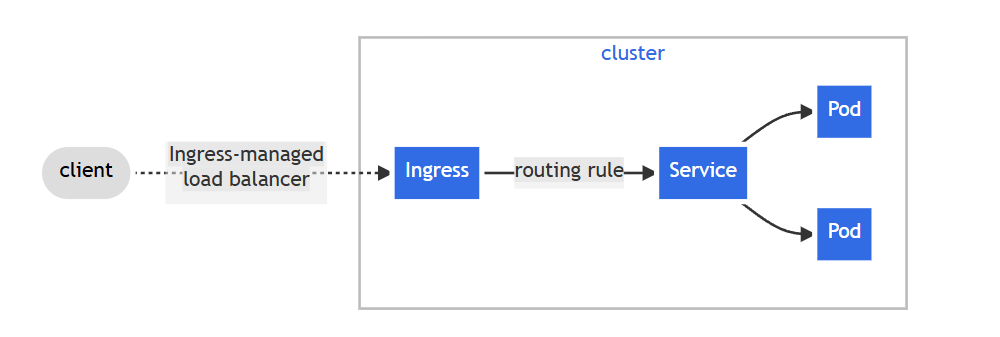

We have successfully deployed our application on a Kubernetes cluster. However, over time, the traffic became overwhelming and the existing single instance of the application can no longer handle it. As your DevOps Manager, I decided to create multiple application instances to manage the traffic flow efficiently. To accomplish this, the company needs a configurable tool that can manage traffic routing and distribution effectively.

I need you to install and configure Nginx Ingress controller on the Kubernetes cluster to fulfill the following requirements:

distribute traffic to multiple application instances

secure the API, which is not available to public users, using username & password

limit request per minute to avoid Denial of Service attacks

configure timeout for when the API is slow

Para poder utilizar el service de loadbalancer en una consola local utilizando minikube, es importante usar un tunnel con:

- minikube tunnel

para poder simular un balanceador de cargar y asignar una ip externa, de lo contrario no va a funcionar.

Para acceder a los curls que indica el lab:
curl http://localhost -> Para probar el ingress-nginx
curl http://localhost:8111 -> Probar devsecops-loan-loadbalancer

usar la ip del cluster, en este caso minikube.

- minikube ip

